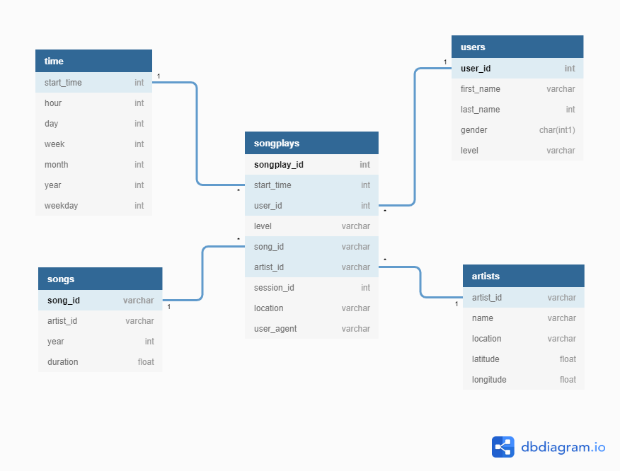

# Project 4: Data Lake


## Introduction
---

A music streaming startup, Sparkify, has grown their user base and song database even more and want to move their data warehouse to a data lake. Their data resides in S3, in a directory of JSON logs on user activity on the app, as well as a directory with JSON metadata on the songs in their app.
My task is to build an ETL pipeline that 1) extracts their data from S3, 2) processes them using Spark, and 3) loads the data back into S3 as a set of dimensional tables and a fact table.

## Datasets
---

Two working datasets are residing in S3 are:
* Song data: `s3://udacity-dend/song_data`
* Log data: `s3://udacity-dend/log_data`

### Song Dataset
The first dataset is a subset of real data from the [Million Song Dataset](https://labrosa.ee.columbia.edu/millionsong/). Each file is in JSON format and contains metadata about a song and the artist of that song. The files are partitioned by the first three letters of each song's track ID. For example, here are filepaths to two files in this dataset.

```
song_data/A/B/C/TRABCEI128F424C983.json
song_data/A/A/B/TRAABJL12903CDCF1A.json
```

### Log Dataset
The second dataset consists of log files in JSON format based on the songs in the dataset above. 
The log files are partitioned by year and month. Below is a snippet of how one log file looks like.


## Database schema
---

The song and log datasets are loaded into tables following a star schema, which is optimized for queries on song play analysis.


### Fact Table
  1. **songplays** - records in log data associated with song plays i.e records with page `NextSong`

### Dimension Tables
  2. **users** - users in the app
  3. **songs** - songs in music database
  4. **artists** - artists in music database
  5. **time** - timestamps of records in **songplays** broken down into specific units

## How to Run
---

1. Fill out information in `dl.cfg`. Remember not to add double-quotes. 
```
AWS_ACCESS_KEY_ID=
AWS_SECRET_ACCESS_KEY=
```

2. Run `etl.py`